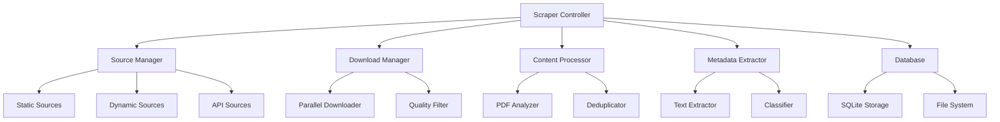

# Design Document

## Overview

The optimized educational PDF scraper will transform the existing basic scraper into a robust, scalable system capable of collecting thousands of high-quality educational PDFs from diverse academic sources. The design focuses on maximizing collection efficiency, implementing intelligent content filtering, and providing comprehensive metadata extraction for educational app integration.

## Architecture

### Core Components



### Enhanced Source Discovery System

The current scraper uses a limited set of hardcoded sources. The optimized version will implement:

1. **Adaptive Source Discovery**: Automatically discover new PDF sources through link analysis
2. **Multi-Strategy Scraping**: Support for static HTML, JavaScript-rendered content, and API endpoints
3. **Intelligent Crawling**: Follow academic site structures to discover course materials and research papers

### Parallel Processing Architecture

Replace the current sequential processing with:

1. **Async Download Manager**: Use `aiohttp` for concurrent downloads
2. **Worker Pool**: Process PDFs in parallel using `multiprocessing`
3. **Queue System**: Implement producer-consumer pattern for scalable processing

## Components and Interfaces

### 1. Enhanced Source Manager

```python
class SourceManager:
    def discover_sources(self, seed_urls: List[str]) -> List[PDFSource]
    def validate_source(self, source: PDFSource) -> bool
    def get_adaptive_strategy(self, url: str) -> ScrapingStrategy
```

**Responsibilities:**
- Maintain expanded source database with 50+ sources per subject
- Implement source validation and health checking
- Provide adaptive scraping strategies based on site structure

### 2. Intelligent Content Filter

```python
class ContentFilter:
    def is_educational_content(self, pdf_metadata: PDFMetadata) -> bool
    def classify_academic_level(self, content: str) -> AcademicLevel
    def calculate_quality_score(self, pdf_path: Path) -> float
```

**Responsibilities:**
- Filter PDFs based on educational relevance
- Classify content by academic level (high school, undergraduate, graduate)
- Implement quality scoring based on page count, text ratio, and readability

### 3. Advanced Metadata Extractor

```python
class MetadataExtractor:
    def extract_comprehensive_metadata(self, pdf_path: Path) -> PDFMetadata
    def generate_keywords(self, text: str) -> List[str]
    def detect_language_with_confidence(self, text: str) -> Tuple[str, float]
    def classify_subject_area(self, metadata: PDFMetadata) -> str
```

**Responsibilities:**
- Extract title, author, institution, subject from PDF metadata and content
- Generate keyword tags and topic classifications
- Implement language detection with confidence scoring
- Classify content into subject areas using NLP techniques

### 4. Deduplication Engine

```python
class DeduplicationEngine:
    def calculate_content_hash(self, pdf_path: Path) -> str
    def find_similar_documents(self, pdf_metadata: PDFMetadata) -> List[str]
    def select_best_version(self, duplicates: List[PDFMetadata]) -> PDFMetadata
```

**Responsibilities:**
- Implement content-based hashing for duplicate detection
- Use similarity analysis to find near-duplicates
- Select highest quality version when duplicates are found

## Data Models

### Enhanced PDFMetadata

```python
@dataclass
class PDFMetadata:
    filename: str
    title: str
    authors: List[str]
    institution: str
    subject_area: str
    academic_level: AcademicLevel
    language: str
    language_confidence: float
    keywords: List[str]
    page_count: int
    text_ratio: float
    quality_score: float
    content_hash: str
    similarity_hash: str
    download_source: str
    file_size: int
    created_date: datetime
    last_modified: datetime
```

### Source Configuration

```python
@dataclass
class SourceConfig:
    name: str
    base_url: str
    scraping_strategy: ScrapingStrategy
    rate_limit: float
    max_depth: int
    pdf_patterns: List[str]
    subject_areas: List[str]
    languages: List[str]
    is_active: bool
```

### Processing Queue

```python
@dataclass
class ProcessingTask:
    task_id: str
    task_type: TaskType
    url: str
    priority: int
    retry_count: int
    metadata: Dict[str, Any]
```

## Error Handling

### Resilient Download System

1. **Exponential Backoff**: Implement retry logic with increasing delays
2. **Circuit Breaker**: Temporarily disable problematic sources
3. **Graceful Degradation**: Continue processing when individual sources fail
4. **Checkpoint System**: Save progress and resume from interruptions

### Error Categories

- **Network Errors**: Timeout, connection refused, DNS failures
- **Content Errors**: Invalid PDFs, access denied, malformed responses
- **Processing Errors**: PDF corruption, extraction failures, classification errors
- **Storage Errors**: Disk space, permission issues, database locks

## Testing Strategy

### Unit Testing

- **Source Discovery**: Test URL pattern matching and source validation
- **Content Filtering**: Verify educational relevance detection accuracy
- **Metadata Extraction**: Validate PDF parsing and information extraction
- **Deduplication**: Test hash generation and similarity detection

### Integration Testing

- **End-to-End Workflows**: Test complete scraping pipeline
- **Database Operations**: Verify metadata storage and retrieval
- **Error Recovery**: Test resilience under various failure conditions
- **Performance**: Measure throughput and resource usage

### Quality Assurance

- **Content Validation**: Manual review of collected PDFs for educational relevance
- **Metadata Accuracy**: Verify extracted information against source materials
- **Classification Testing**: Validate academic level and subject area assignments
- **Duplicate Detection**: Ensure effective deduplication without false positives

## Performance Optimizations

### Concurrent Processing

1. **Async Downloads**: Use `aiohttp` for non-blocking HTTP requests
2. **Parallel PDF Processing**: Utilize multiprocessing for CPU-intensive tasks
3. **Batch Operations**: Group database operations for efficiency
4. **Memory Management**: Implement streaming for large file processing

### Caching Strategy

1. **Source Caching**: Cache discovered URLs to avoid re-crawling
2. **Metadata Caching**: Store extracted metadata to avoid reprocessing
3. **Content Hashing**: Cache content hashes for fast duplicate detection
4. **Classification Caching**: Cache ML model predictions for similar content

### Resource Management

1. **Connection Pooling**: Reuse HTTP connections for efficiency
2. **Memory Limits**: Implement memory usage monitoring and cleanup
3. **Disk Space Management**: Monitor storage and implement cleanup policies
4. **Rate Limiting**: Respect source server limits and implement adaptive throttling